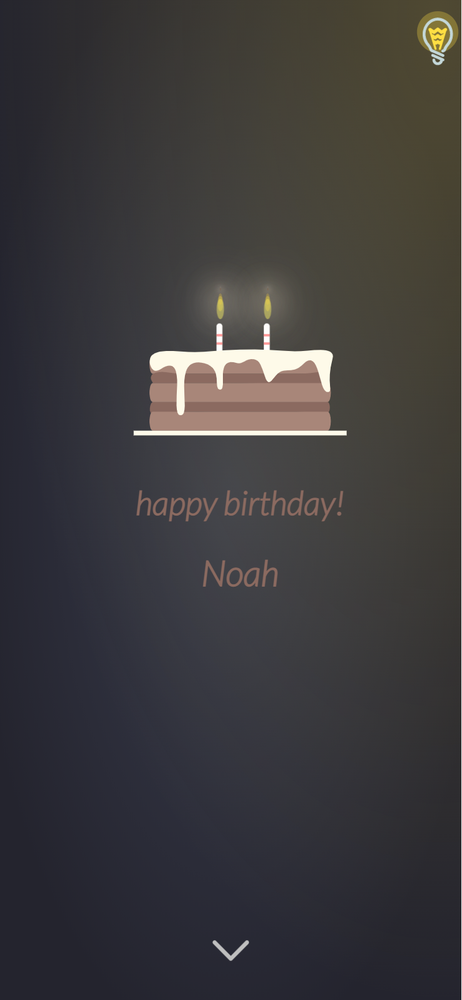

# Birthday
仅仅是手机端  
演示(注意使用手机模式调试) [github pages](https://ziqi-yang.github.io/birthday_gift/)  

## 提示

仅克隆本仓库主分支最新提交命令: `git clone --depth=1 --single-branch -b master https://github.com/Ziqi-Yang/birthday_gift.git`  
在实际使用的时候应使用类似`gitee pages`这样的国内服务，使得不用在微信上“备案”也可以看到这个网页(然而`gitee pages`把缓存设置地很恶心，
你必须清除浏览器记录才能看到变化(微信是清除缓存), 所以到微信里频繁调试)。  
最后的二维码可以用来收集地址(比如可以用来收集生日礼物), 用的是问卷网，像这样:  
。  

### 修改清单

1. 网页标题人名(第5行)
2. 第二页人民(第283行)
3. 第三页二维码(用同名图片文件替换)和点击跳转地址(590行)
4. 如果音乐(3.17mb)播放较卡, 修改`index.html`文件第575行音乐地址, 改为用cdn加速

## Reference

1. [cake](https://codepen.io/fixcl/pen/bGeWvY)
2. [gift](https://codepen.io/Mamboleoo/pen/PZWPZx)
3. [bulb](https://codepen.io/Colouryum/pen/MWPvzG)
